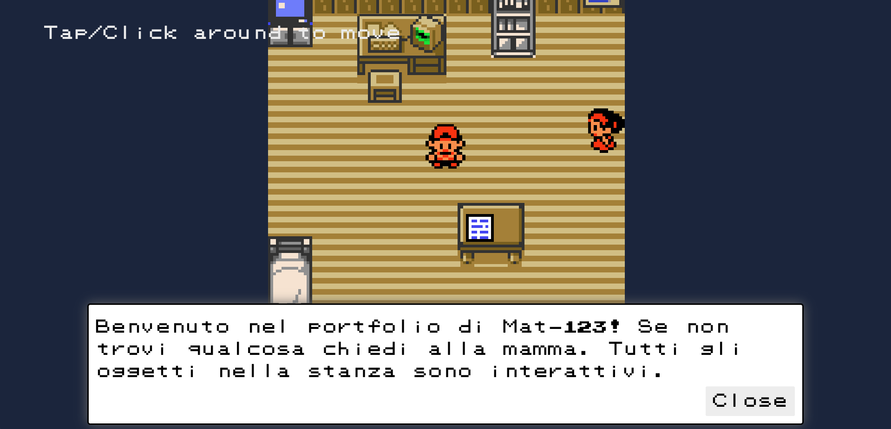

# Interactive Portfolio Game

Benvenuto nel repository del **Interactive Portfolio Game**, un progetto che trasforma un portfolio personale in un'esperienza di gioco interattiva. Utilizzando la libreria **Kaboom.js**, questo progetto offre un modo unico e coinvolgente per esplorare il mio portfolio Mat-123. Tutti gli oggetti nella stanza sono interattivi, e il giocatore può esplorare e interagire con vari elementi per saperne di più sui progetti e le esperienze dell'autore.


Link al sito: [Clicca qui](https://mat-123-portfolio.netlify.app/).



## Funzionalità principali

- **Grafica Animata**: Sprites dettagliati con animazioni fluide per un'esperienza visiva accattivante.
- **Interazione con l'Ambiente**: Tutti gli oggetti nella stanza sono interattivi, fornendo informazioni e dialoghi pertinenti.
- **Movimento del Personaggio**: Controlli del personaggio fluidi tramite il mouse (in futuro implementero' anche la tastiera).
- **Dialoghi Dinamici**: Sistema di dialogo interattivo con opzioni multiple per una maggiore immersione.

## Come Iniziare

1. **Clona il Repository**
    ```bash
    git clone https://github.com/tuo-username/interactive-portfolio-game.git
    cd interactive-portfolio-game
    ```

2. **Installa le Dipendenze**
    Assicurati di avere Node.js installato, poi esegui:
    ```bash
    npm install
    ```

3. **Avvia il Gioco**
    ```bash
    npm start
    ```

4. **Esplora il Portfolio**
    Premi la barra spaziatrice o clicca con il mouse per iniziare a giocare e esplora il portfolio interattivo.

## Struttura del Codice

- **constants.js**: Contiene le costanti globali utilizzate nel gioco.
- **kaboomCtx.js**: Inizializza e configura il contesto di Kaboom.js.
- **utils.js**: Funzioni di utilità per la gestione dei dialoghi e della camera.
- **main.js**: Codice principale che gestisce le scene e la logica del gioco.
